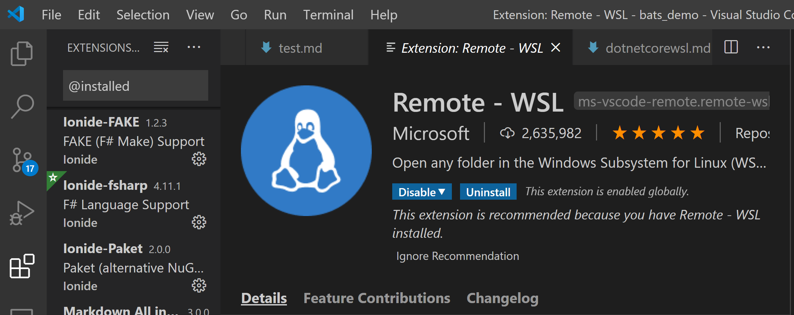
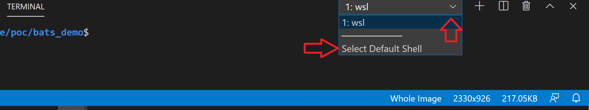
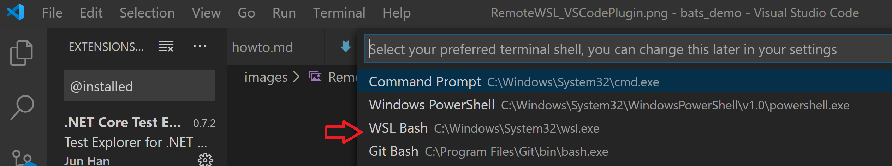

# BATS testing demo


I am no way an expert but have been crafting [bash](https://www.gnu.org/software/bash/manual/bash.html) scripts here and there for some time now, mostly for [CI/CD](https://en.wikipedia.org/wiki/CI/CD) pipelines. Nothing wrong with that except the use of the word "crafting", as I did no such thing. I normally put something together as a script and pray it will never be changed and will keep working as expected by the shear force of repetition... :) enough said...

Using bash scripts to speed up my own software development activities is something I like, for example , creating blank dotnet core solutions to perform katas and quick tests.

To improve my skill in bash and do that in a consistent and sistematic way, I've decided to find a way to perform test driven development while __"crafting"__ my own scripts. 

Uppon a few minutes googling, I bumped into [bats](https://github.com/bats-core/bats-core) originally via Sam Stepheson (his repo [here](https://github.com/sstephenson/bats)), which is a [TAP compliant](https://en.wikipedia.org/wiki/Test_Anything_Protocol) testing framework for bash, a simile to [pester](https://devblogs.microsoft.com/scripting/unit-testing-powershell-code-with-pester/) in the __Powershell__ world. _(if you prefer more verbose stuff and wasting fingertips... outch! )_.

Hence, after a go at it... this demo happened.

Without further ado, I will try to:
- describe the prerequisites to run bats on your windows 10 env.
- describe setting up bats and use within VSCode.
- give an example of test first for a pseudo requirement.
- describe how can one use bats within CI/CD pipeline. will use circle.
- try out developg using a bats docker container.
## prerequisites:
- Windows 10 pro OS.
- [Git Bash](https://git-scm.com/) or any other [git](https://git-scm.com/book/en/v2/Getting-Started-Installing-Git) ... [client](https://git-scm.com/download/gui/windows).
- [vscode](https://code.visualstudio.com/docs/setup/windows) and [dotnet core sdk 3.1](https://dotnet.microsoft.com/download/dotnet-core/3.1) installed. if ot you will need to do so using links provided.
- [Windows Linux Subsystem](https://docs.microsoft.com/en-us/windows/wsl/install-win10) - WSL1 (ideally WSL2) setup on your windows 10 pro OS. I prefer [Ubuntu](https://ubuntu.com/wsl) as am used to Debian command structure, but you can use any available linux flavour.
- [Docker desktop for windows](https://hub.docker.com/editions/community/docker-ce-desktop-windows) (optional)
- presuming you have some familiarity with vscode.
  
## setting up bats and use in vscode :

you will need to install bats in the wsl env, then clone this demo repo, open vscode, install a few plugins, and run existing bats test.

### open your ubuntu wsl terminal and run below commands. That will install bats and required libraries.
```sh
    sudo apt install bats
    sudo apt update
```

### install dotnet core 3.1 sdk on your wsl environment if not already. For more detail [follow this](https://docs.microsoft.com/en-us/dotnet/core/install/linux-package-manager-ubuntu-1910). Alternativelly I have put all required steps [here](dotnetcorewsl.md)

### clone this demo [git repo](https://github.com/fcavaco/bats_demo.git) :
```sh
git clone https://github.com/fcavaco/bats_demo.git
```
- note goes without saying you shuld not clone a repo to an unknown location...I normally use `/c/code/samples` root for all my cloned repos (those that are not mine), seems to me a good practice to always do it same location so that I can quickly locate and get rid once done.
  
then, __open vscode__ inside the local repo directory.
```sh
cd ./bats_demo
code .
```
- if you don't have wsl pointing to your vscode windos installation you may need to run above in a dos prompt, git bash, et cetera. you can also dig out how to point vscode from wsl...
  
### add [J-Et. Martin "Bats"](https://marketplace.visualstudio.com/items?itemName=jetmartin.bats) plugin to vscode.


### add Microsoft "Remote - WSL" plugin to vscode.



- there are many ways to access your wsl terminal from within vscode, for example as advised [here](https://marketplace.visualstudio.com/items?itemName=ms-vscode-remote.remote-wsl), but I normally prefer to get it straight from the terminal window as depicted below.



- you can then toggle the terminal on/off with ctrl+' .

### install additional bats libraries/scripts as git submodules.
- located at the root of your **demo_bats** local repo directory.
```sh
git submodule add -f https://github.com/ztombol/bats-support test/libs/bats-support

git submodule add -f https://github.com/ztombol/bats-assert test/libs/bats-assert

```
- assert.bash allows for **more fluent syntax** in assertions. e.g. assert_equal, assert_failure, assert_success are all functions that this script brings. So, it is worth to install. assert depends on the support script in turn, so not one without the other unfortanly.
  
### try it out by running the test.bats file under test directory...
```sh
cd ./test
bats test.bats
```

## Test First approach using bats

### Pseudo requirements

- Write a script to create a dotnet core solution containing a class library project, and a unit test project.
- One argument shall be the solution name.
- Both project names are derived from the solution name by convention. <sol>CL.<projext> , <sol>UT.<projext>.
- **class name** on the **class library project** is called **Library.fs** or **Library.cs** depending on the language used.
- **class name** on the **unit tests project** is called **LibraryTests.fs** or **LibraryTests.cs**.
- A root directory is created based on the solution name.
- There is a further argument, language, which determines the kind of <projext> project extension, such that: F# -> .fsproj, C# -> .csproj, assume it only accepts these two languages.
- A **git repo** is created.
- A **readme markdown file** is created.
- A **GNU license** file is created.
  
**validation**:
- **solution name** argument is **always required**.
- **solution name** argument is an **alphanumeric** string.
- **script option** for solution name argument is **-s**.
- **language** is an **optional argument** and it **defaults to C#** when not passed.
- **script option** for language argument is **-l**.
- **class library** project is placed under a folder called **src**.
- **unit test** project is placced under a folder called **test**. 
  

**expected folder structure (F# example)**
```xml
  <Solution>
    .config
    .git
    .paket
    src
        <Project>
            Library.fs
            <Project>.fsproj
            paket.references
    test
        <ProjectTests>
            LibraryTests.fs
            <ProjectTests>.fsproj
            paket.references
    .gitignore  
    paket.dependencies
    paket.lock
    readme.md
    <Solution>.sln
```

